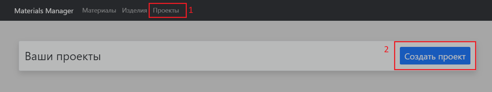

# Калькулятор материалов
Приложение предназначено для расчёта количества материалов.
## Как пользоваться
- Сначала нужно добавить имеющиеся материалы. По умолчанию в программе уже предусмотрены все основные виды материалов, но если нужно добавить другие, то 
это можно сделать на странице "Создание материалов", введя название материала и нажав на кнопку "Добавить материал". После добавления новый материал отобразится в списке.

- Имеющиеся материалы используются в создании изделий - брусьев, светильников и другого. Изначально в программу добавлены все основные виды изделий, но наподобии с созданием
материалов, можно добавить новое изделие. Для этого нужно перейти на вкладу "Изделия" в главном меню и
ввести название нового изделия, а снизу выбрать из списка, из каких материалов будет состоять изделие. В этом списке будут отображаться добавленные ранее материалы.

- Чтобы посчитать, какие материалы необходимы для выбранных изделий, нужно перейти во вкладку "Проекты", после чего нажать на кнопку "Создать проект". 
После этого появится окно с множеством параметров. Среди них можно ввести: общий периметр помещения, в котором должны производиться работы, периметр небетонных стен 
(не может быть больше общего периметра), изделия, которые будут входить в данный проект и работы, которые будут производиться. Все эти параметры влияют на то, какие материалы
и какое их количество будет использовано.

Всё, что выделено синей рамкой необязательно к заполнению, но есть несколько исключений: минимально нужно выбрать либо работы, которые будут применяться к проекту, либо
изделия, которые будут в нём использоваться. Если вы выбрали работы, в которых нельзя указать периметр самостоятельно (напр. работа по плитке), то нужно также указать периметр помещения в блоке "Общая информация".
- Чтобы посмотреть на суммарное количество использованных материалов, нужно перейти во вкладку "Проекты" - там будет список со всеми добавленными проектами. Для получения
информации об использованных материлах, нужно нажать на кнопку "Получить детализацию" соответствующего проекта. После нажатия на кнопку будет отображена вся необходимая 
информация.

